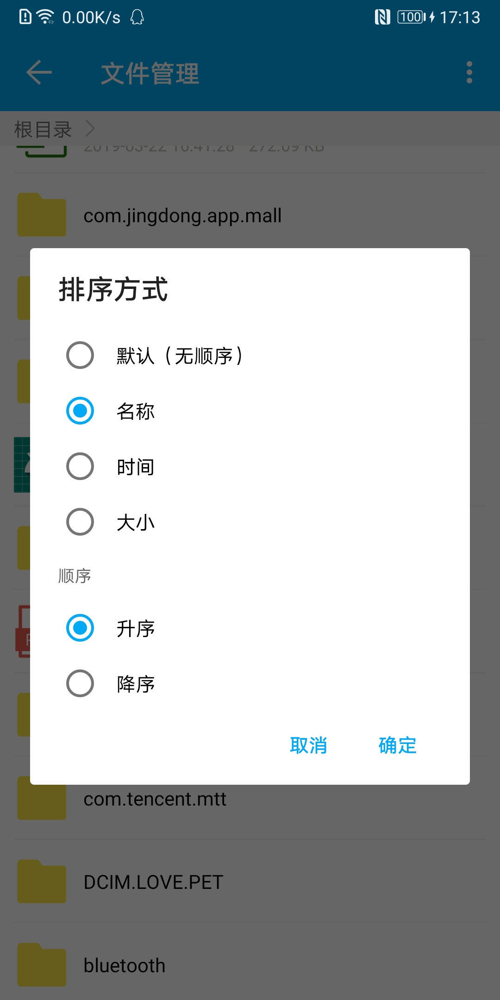
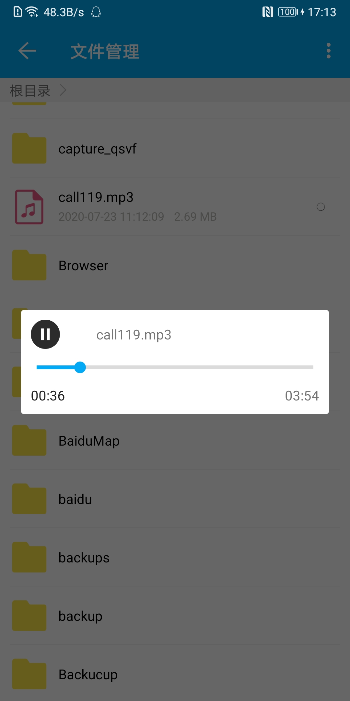
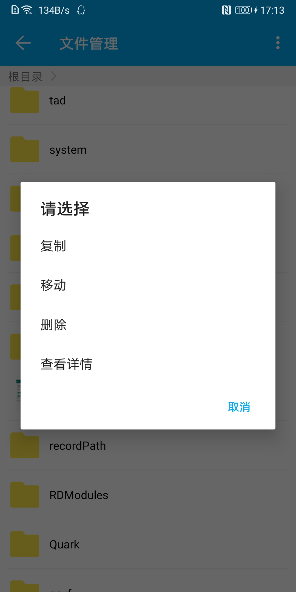
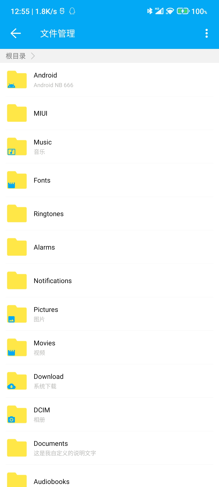

[](https://github.com/zippo88888888/ZFileManager)
[](https://github.com/zippo88888888/ZFileManager)
[](https://www.apache.org/licenses/LICENSE-2.0)

# 特点

### 1. 默认支持 音频，视频，图片，txt，zip，word，excel，ppt，pdf 9种文件
### 2. 支持音频、视频播放，图片查看，zip解压，文件重命名、复制、移动、删除、查看详情
### 3. 支持查看指定文件类型，支持文件类型拓展，支持嵌套在Fragment中使用
### 4. 支持多选，数量、文件大小限制、实时排序、指定文件路径访问
### 5. 支持QQ、微信文件选择（支持自定义获取）
### 6. 高度可定制化，支持Android 10++、AndroidX、DSL，兼容Java


### 部分截图
<div align="center">




</div>

## 基本使用 （[Java使用](https://github.com/zippo88888888/ZFileManager/blob/master/app/src/main/java/com/zp/zfile_manager/JavaSampleActivity.java)）

> ##### 温馨提示： targetSdkVersion >= 29 清单文件中加上 android:requestLegacyExternalStorage="true"
> ##### 温馨提示： targetSdkVersion >= 29 清单文件中加上 android:requestLegacyExternalStorage="true"
> ##### 温馨提示： targetSdkVersion >= 29 清单文件中加上 android:requestLegacyExternalStorage="true"


#### Step 0. 添加依赖

#### [最新版本](https://github.com/zippo88888888/ZFileManager/wiki/%E7%89%88%E6%9C%AC)

```groovy

    // Android 10++ 以上  暂时只提供 aar， maven 上传太难搞了，但后续肯定会提供的，先aar使用

    // Android 10 及以下版本使用
    implementation 'com.github.zp:z_file:1.2.6' 

    如果报错加上
    
    // Kotlin Parcelable 支持
    androidExtensions {
        experimental = true
    }

```

#### Step 1. 实现ZFileImageListener，并在调用前或Application中初始化 
```Kotlin

class MyFileImageListener : ZFileImageListener() {

    override fun loadImage(imageView: ImageView, file: File) {
        // 以Glide为例
        Glide.with(imageView.context)
            .load(file)
            .apply(RequestOptions().apply {
                placeholder(R.drawable.ic_zfile_other)
                error(R.drawable.ic_zfile_other)
            })
            .into(imageView)
    }
}

// 在调用前或Application中初始化 
getZFileHelp().init(MyFileImageListener())
```
#### Step 2. 在Activity或Fragment中使用

```kotlin

class MainActivity : AppCompatActivity() {

    override fun onCreate(savedInstanceState: Bundle?) {
        super.onCreate(savedInstanceState)
        setContentView(R.layout.activity_main)
        main_defaultMangerBtn.setOnClickListener {
            // DSL 方式
            zfile { 
                result {
                    setFileListData(this)
                }
            }
            // 普通 方式 
            getZFileHelp()
                .result(this) {
                     setFileListData(this)
                }
        }
    }
    
    private fun setFileListData(fileList: MutableList<ZFileBean>?) {
        val sb = StringBuilder()
        fileList?.forEach {
            sb.append(it).append("\n\n")
        }
        main_resultTxt.text = sb.toString()
    }

}


```

## 高级用法   
> ###### ZFileManager提供了对外的帮助类 [ZFileHelp](https://github.com/zippo88888888/ZFileManager/blob/master/z_file/src/main/java/com/zp/z_file/util/ZFileHelp.kt)

### 文件类型拓展

#### Step 0. 新建一个类：ZFileType，重写 openFile()、loadingFile()方法

```kotlin

// 自定义的类型
const val APK = "apk"

/**
 * 自定义Apk文件类型
 */
class ApkType : ZFileType() {

    /**
     * 打开文件
     * @param filePath  文件路径
     * @param view      当前视图
     */
    override fun openFile(filePath: String, view: View) {
        Toast.makeText(view.context, "打开自定义拓展文件", Toast.LENGTH_SHORT).show()
    }

    /**
     * 加载文件
     * @param filePath 文件路径
     * @param pic      文件展示的图片
     */
    override fun loadingFile(filePath: String, pic: ImageView) {
        pic.setImageResource(R.mipmap.ic_launcher_round)
    }
    
}

```

#### Step 1. 新建一个类：ZFileTypeListener，重写 getFileType()方法 （有多个自定义类型，公用即可）
```kotlin

class MyFileTypeListener : ZFileTypeListener() {

    override fun getFileType(filePath: String) =
        when (ZFileHelp.getFileTypeBySuffix(filePath)) {
            APK -> ApkType()
            else -> super.getFileType(filePath)
        }
}

```

#### Step 2. 在调用前或Application中配置

```kotlin
getZFileHelp().setFileTypeListener(MyFileTypeListener())

```

### QQ或微信文件选择

> QQ、微信默认根据时间倒序排序，不显示隐藏文件，过滤规则默认，只显示文件，不支持长按操作
其他配置与文件管理保持一致！具体可查看[这里](https://github.com/zippo88888888/ZFileManager/blob/master/app/src/main/java/com/zp/zfile_manager/super_/SuperActivity.kt)
，参考 [腾讯文件](https://imtt.dd.qq.com/16891/apk/24CB038F3A67CDBE10C5A0D9B2AD10E9.apk?fsname=com.tencent.FileManager_5.0.4.0001_5040001.apk&csr=1bbd)
```kotlin

    super_qqTxt.setOnClickListener {
        // 打开QQ文件选择
        getZFileHelp().setConfiguration(getZFileConfig().apply {
            filePath = ZFileConfiguration.QQ // 必须设置
        }).result(this) {
            setResult(this)
        }
    }

    super_wechatTxt.setOnClickListener {
        // 打开微信文件选择
        getZFileHelp().setConfiguration(getZFileConfig().apply {
            filePath = ZFileConfiguration.WECHAT // 必须设置
        }).result(this) {
            setResult(this)
        }
    }

    private fun setResult(selectList: MutableList<ZFileBean>?) {
        val sb = StringBuilder()
        selectList?.forEach {
            sb.append(it).append("\n\n")
        }
        super_resultTxt.text = sb.toString()        
    }


```

### DSL

```kotlin
    zfile {
            imageLoade {
                // 配置 ZFileImageListener
            }
            fileLoade {
                // 配置 ZFileLoadListener
            }
            qwLoade {
                // 配置 ZQWFileLoadListener
            }
            config {
                // 配置 ZFileConfiguration
            }
            fileType {
                // 配置 ZFileTypeListener
            }
            fileOperate {
                // 配置 ZFileOperateListener
            }
            fileOpen {
                // 配置 ZFileOpenListener
            }
            result {
                // 获取结果
            }
        }
```

#### 举个栗子

```kotlin

class MainActivity : AppCompatActivity() {

    override fun onCreate(savedInstanceState: Bundle?) {
        super.onCreate(savedInstanceState)
        setContentView(R.layout.activity_main)
        main_defaultMangerBtn.setOnClickListener {
            dsl()
        }
    }
    
    private fun dsl() {
        zfile {
            fileType {
                MyFileTypeListener()
            }
            config {
                ZFileConfiguration().apply {
                    filePath = ZFileConfiguration.WECHAT
                }
            }
            result {
                val sb = StringBuilder()
                this?.forEach {
                    sb.append(it).append("\n\n")
                }
                main_resultTxt.text = sb.toString()
            }
        }
    }

}

    
```

##### 搞定，是不是很简单 ^_^

> ###### 切，简单是简单，但是你这个获取文件实现的方式不优雅，你这个QQ、微信文件根本不能获取，你界面上的图片太low了，打开文件你全部都是调用系统方式打开的(作者你个渣渣)，我只想选择文件，不想要长按事件，文件操作我怎么用都感觉不正确，还有长按事件弹出的功能有些不是我想要的...
> ###### 扶我起来，我要搞死杠精

#

#### 自定义文件获取
> ##### 注意：此方式排序、是否显示隐藏文件、过滤规则等等操作都需要自己实现
> ##### Kotlin 获取配置信息：getZFileConfig()
> ##### Java 获取配置信息：ZFileManageHelp.getInstance().getConfiguration()
```kotlin

class MyFileLoadListener : ZFileLoadListener {

    override fun getFileList(context: Context?, filePath: String?) =
        getFileList(context, filePath)

    private fun getFileList(context: Context?, filePath: String?): MutableList<ZFileBean> {
         // 实现
    }
}

// 在调用前或Application中配置
getZFileHelp().setFileLoadListener(MyFileLoadListener())


```

#### 自定义QQ、微信文件获取

> ##### 通过简单配置 即可实现 绝大部分 的需求，推荐下面的方式！如果此方式依旧无法符合你的需求！请自定义实现，[点击查看](https://github.com/zippo88888888/ZFileManager/blob/master/app/src/main/java/com/zp/zfile_manager/diy/MyQWFileListener.kt)

```kotlin

       // 配置 标题
       val TITLES: Array<String>
            get() {
                return arrayOf("Image", "Video", "WD", "Other")
            }
    
       // 配置 过滤规则
       val FILTER: ArrayMap<Int, Array<String>>
           get() {
               val map = ArrayMap<Int, Array<String>>()
               map[ZFILE_QW_PIC] = arrayOf(PNG, JPEG, JPG, GIF)
               map[ZFILE_QW_MEDIA] = arrayOf(MP4, _3GP, "rmvb", "mp3", "aac")
               map[ZFILE_QW_DOCUMENT] = arrayOf(TXT, JSON, XML, DOC,  XLS,  PPT,  PDF)
               map[ZFILE_QW_OTHER] = arrayOf("") // 空表示 其他文件类型
               return map
           }
   
       // 配置 QQ 的 路径，微信同理
       val QQ_MAP: ArrayMap<Int, MutableList<String>>
            get() {
                val map = ArrayMap<Int, MutableList<String>>()
                map[ZFILE_QW_PIC] = arrayListOf(
                    "/storage/emulated/0/tencent/QQ_Images/",
                    "/storage/emulated/0/Pictures/", // 仅作演示
                    "/storage/emulated/0/DCIM/", // 仅作演示
                    "/storage/emulated/0/Pictures/QQ/"
                )
                map[ZFILE_QW_MEDIA] = arrayListOf(
                    "/storage/emulated/0/Pictures/QQ/",
                    "/storage/emulated/0/tencent/MicroMsg/WeiXin/" // 仅作演示
                ) 
                map[ZFILE_QW_DOCUMENT] = arrayListOf(
                    "/storage/emulated/0/Android/data/com.tencent.mobileqq/Tencent/QQfile_recv/",
                    "/storage/emulated/0/Android/data/com.tencent.mobileqq/Tencent/QQ_business/"
                )
                map[ZFILE_QW_OTHER] = arrayListOf(
                    "/storage/emulated/0/Android/data/com.tencent.mobileqq/Tencent/QQfile_recv/",
                    "/storage/emulated/0/Android/data/com.tencent.mobileqq/Tencent/QQ_business/",
                    "/storage/emulated/0/tencent/MicroMsg/Download/"
                )
                return map
            }
    
       // 使用
       getZFileHelp().setConfiguration(getZFileConfig().apply {
          qwData = ZFileQWData().apply {
              titles = TITLES
              filterArrayMap = FILTER
              qqFilePathArrayMap = QQ_MAP
              wechatFilePathArrayMap = WECHAT_MAP
          }
       }).result(this) {
           setResultData(this)
       }


```

#### UI 或操作自定义 更多可查看 [ZFileConfiguration](https://github.com/zippo88888888/ZFileManager/blob/master/z_file/src/main/java/com/zp/z_file/content/ZFileConfiguration.kt) 或 [values](https://github.com/zippo88888888/ZFileManager/tree/master/z_file/src/main/res/values)
 
```kotlin

    /**
     * 起始访问位置，非空为指定访问目录，空为SD卡根目录
     * 还可指定QQ或微信目录
     */
    var filePath: String? = null

    /**
     * QQ、Wechat 配置信息
     */
    var qwData = ZFileQWData()

    ...
    ...
    ...

    /**
     * 是否需要长按事件
     */
    var needLongClick = true

    /**
     * 默认只有文件才有长按事件
     */
    var isOnlyFileHasLongClick = true

    /**
     * 长按后需要显示的操作类型
     */
    var longClickOperateTitles: Array<String>? = null

    /**
     * 相关资源配置 设置：[ZFILE_DEFAULT] 将使用默认资源
     * @property audioRes Int        音频
     * @property txtRes Int          文本
     * @property pdfRes Int          PDF
     * @property pptRes Int          PPT
     * @property wordRes Int         Word
     * @property excelRes Int        Excel
     * @property zipRes Int          ZIP
     * @property otherRes Int        其他类型
     * @property emptyRes Int        空资源
     * @property folderRes Int       文件夹
     * @property lineColor Int       列表分割线颜色
     */
    @Parcelize
    data class ZFileResources @JvmOverloads constructor(
        var audioRes: Int = R.drawable.ic_zfile_audio,
        var txtRes: Int = R.drawable.ic_zfile_txt,
        var pdfRes: Int = R.drawable.ic_zfile_pdf,
        var pptRes: Int = R.drawable.ic_zfile_ppt,
        var wordRes: Int = R.drawable.ic_zfile_word,
        var excelRes: Int = R.drawable.ic_zfile_excel,
        var zipRes: Int = R.drawable.ic_zfile_zip,
        var otherRes: Int = R.drawable.ic_zfile_other,
        var emptyRes: Int = R.drawable.ic_zfile_empty,
        var folderRes: Int = R.drawable.ic_zfile_folder,
        var lineColor: Int = R.color.zfile_line_color
    ) : Serializable, Parcelable
    
    // 在调用前或Application中配置
     getZFileHelp().setConfiguration(getZFileConfig().apply {
            resources = ZFileResources(R.drawable.ic_diy_audio)
            maxLength = 6
            maxLengthStr = "666"
            ...
            ...
            ...
        })
    
    // 其他自定义方式 如：Txt类型展示的图片不符合你的要求，继承自TxtType，重写相关方法即可，
    // 这种方式对于内置的文件类型可以达到完全自定义操作

```
#### 自定义打开默认支持的文件
```kotlin

class MyFileOpenListener : ZFileOpenListener() {

    override fun openAudio(filePath: String, view: View) = Unit // 音频
    override fun openImage(filePath: String, view: View) = Unit // 图片
    override fun openVideo(filePath: String, view: View) = Unit // 视频
    override fun openTXT(filePath: String, view: View) = Unit // 文本
    override fun openZIP(filePath: String, view: View) = Unit // zip压缩包
    override fun openDOC(filePath: String, view: View) = Unit // word
    override fun openXLS(filePath: String, view: View) = Unit // xls
    override fun openPPT(filePath: String, view: View) = Unit // ppt
    override fun openPDF(filePath: String, view: View) = Unit // pdf
    override fun openOther(filePath: String, view: View) = Unit // 其他文件
}

// 在调用前或Application中配置
getZFileHelp().setFileOpenListener(MyFileOpenListener())

```
#### 自定义文件操作

```kotlin

class MyFileOperateListener : ZFileOperateListener() {

    /**
     * 文件重命名（该方式只需要实现重命名逻辑即可）
     * @param filePath String       文件路径
     * @param fileNewName String    新名字
     * @param context Context       Context
     * @param block Function2<Boolean, String, Unit> Boolean：成功或失败；String：新名字
     */
    override fun renameFile(
        filePath: String,
        fileNewName: String,
        context: Context,
        block: (Boolean, String) -> Unit
    ) {
       
    }

    /**
     * 复制文件 耗时操作，建议放在非UI线程中执行
     * @param sourceFile String     源文件地址
     * @param targetFile String     目标文件地址
     * @param context Context       Context
     * @param block                 文件操作成功或失败后的监听
     */
    override fun copyFile(
        sourceFile: String,
        targetFile: String,
        context: Context,
        block: Boolean.() -> Unit
    ) {
       thread {
           val success = MyFileUtil.copyFile(sourceFile, targetFile, context)
           (context as? Activity)?.let { 
               it.runOnUiThread { 
                   block.invoke(success)
               }
           }
       }
    }

    /**
     * 移动文件 耗时操作，建议放在非UI线程中执行
     */
    override fun moveFile(
        sourceFile: String,
        targetFile: String,
        context: Context,
        block: Boolean.() -> Unit
    ) {
    
    }

    /**
     * 删除文件 耗时操作，建议放在非UI线程中执行
     */
    override fun deleteFile(filePath: String, context: Context, block: Boolean.() -> Unit) {
         
    }

    /**
     * 解压文件 耗时操作，建议放在非UI线程中执行
     */
    override fun zipFile(
        sourceFile: String,
        targetFile: String,
        context: Context,
        block: Boolean.() -> Unit
    ) {
    }

    /**
     * 文件详情
     */
    override fun fileInfo(bean: ZFileBean, context: Context) {
        
    }
}

// 在调用前或Application中配置
getZFileHelp().setFileOperateListener(MyFileOperateListener())

```
 
##### 更多操作请查看demo， ^_^ 如果觉得可以 star 一下哦！
###### 源自 [FileManager](https://github.com/zippo88888888/FileManager)  [点这里页面加载速度应该会快一点](https://blog.csdn.net/qq_28322987/article/details/81384886)
 

> ##### 还是不行，emmmm 源码给你 想怎么弄就怎么弄  溜了溜了

[](https://github.com/zippo88888888/ZFileManager)
[](https://github.com/zippo88888888/ZFileManager)
[](https://www.apache.org/licenses/LICENSE-2.0)


 
